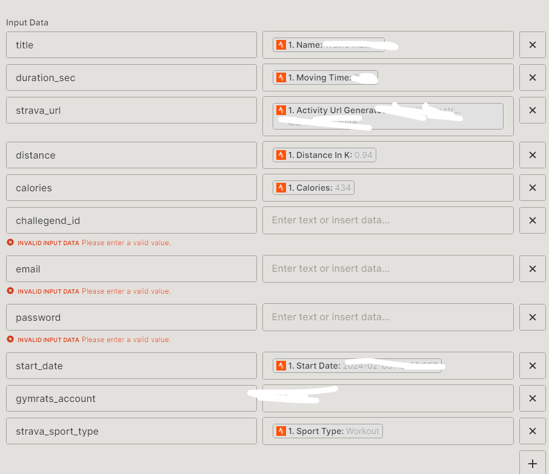

# StravaToGymRats

A integração é feita usando o ZAPIER que obseva quando tem uma nova atividade no STRAVA e sincroniza com o GYMRATS.


# Como usar 
## Primeiro passo:

Crie uma conta no [ZAPIER](https://zapier.com/), a conta é gratuita e o plano gratuito é o suficiente para o projeto.

## Crie um novo "ZAP"

  * Em 1. Trigger, selecione STRAVA e Event: "New Athlete Activity"  - Para o primeiro acesso será necessario realizar a autenticação com a conta do STRAVA.
  * Em 2. Actions, selecione "Code By Zapier" e Event "Run Python"

## Action Setup
 Vamos configurar o codigo python dentro de ACTION Code By Zappier
 
  * Input Data: Onde vamos informar os parametros do strava e tambem do gymrats para o codigo python
  * Code: Onde iremos inserir o nosso codigo em python do arquivo [gymrats.py](gymrats.py) 

### input data
Deixe o input data como a imagem
 



Salve os dados e publique, vc pode clicar no botão de testar parar testar a automação.

# Snippets 

Abaixo vou daixar os snippets de codigo para vc acessar informações de sua conta GYMRATS

### *Obter o token*
```python

import requests

url = "https://www.gymrats.app/api/tokens"

# Troque o caractere do @ por %40 
payload = "email=<EMAIL>&password=<SENHA>"
headers = {
  'Content-Type': 'application/x-www-form-urlencoded',
  'Content-Length': '47',
  'Connection': 'close',
  'Accept-Encoding': 'gzip, deflate, br'
}

response = requests.request("POST", url, headers=headers, data=payload)

print(response.text)

```
Exemplo de Resposta
```json
{
    "data": {
        "id": INT,
        "token": STR,
        "email": "STR",
        "profile_picture_url": "STR",
        "full_name": "STR",
        "chat_message_notifications_enabled": BOOL,
        "comment_notifications_enabled": BOOL,
        "workout_notifications_enabled": BOOL
    },
    "status": "STR"
}
```
* ID: Você irá precisar no input_data


### *Obter atividades gymrats*


```python
import requests

url = "https://www.gymrats.app/api/accounts/<ACCOUNT_ID|USER_ID>/workouts"

payload = {}
headers = {
  'Authorization': 'TOKEN GERADO ACIMA',
  'TE': 'gzip, deflate; q=0.5',
  'Connection': 'Keep-Alive',
  'Accept-Encoding': 'gzip, deflate, br'
}

response = requests.request("GET", url, headers=headers, data=payload)

print(response.text)


```


Exemplo de Resposta
```json
{
    "data": [
        {
            "id": "int",
            "description": null,
            "title": "str",
            "duration": 112,
            "media": [
                {
                    "id": 5786492,
                    "width": 1220,
                    "url": "str",
                    "height": 1635,
                    "medium_type": "image/jpg",
                    "thumbnail_url": "str",
                    "aspect_ratio": "int"
                }
            ],
            "points": null,
            "account": {
                "id": "int",
                "email": "str",
                "profile_picture_url": "str",
                "full_name": "str"
            },
            "steps": null,
            "distance": "int",
            "challenge_id": "int",
            "gym_rats_user_id": "int",
            "activity_metric_amount": null,
            "created_at": "str",
            "photo_url": "str",
            "occurred_at": "",
            "apple_workout_uuid": null,
            "calories": 700,
            "formatted_details": {
                "duration": "112",
                "points": null,
                "steps": null,
                "distance": "2",
                "activity_metric_amount": null,
                "calories": "700"
            },
            "activity_type": null,
            "apple_device_name": null,
            "apple_source_name": null,
            "google_place_id": null,
            "activity": null
        }
    ],
    "status": "str"
}
```

* challenge_id: Você irá precisar no input_data


# Outro Snippets


### *Inserir uma atividade*

```python

import requests
import json

url = "https://www.gymrats.app/api/workouts"

payload = json.dumps({
  "title": "teste 3",
  "description": "teste",
  "challenges": [
    {
      "id": ,
      "activity_type_id": None,
      "activity_metric_amount": None
    }
  ],
  "media": [
    {
      "url": "",
      "thumbnail_url": "",
      "medium_type": "image/jpg",
      "width": 670,
      "height": 563
    }
  ],
  "duration": 99,
  "distance": "54.680664916885384",
  "steps": 66,
  "calories": 55,
  "points": None,
  "occurred_at": "2024-01-05T17:59:00"
})
headers = {
  'Content-Type': 'application/json',
  'Authorization': '',
  'TE': 'gzip, deflate; q=0.5',
  'Content-Length': '499',
  'User-Agent': 'Dalvik/2.1.0 (Linux; U; Android 12; Nexus 5 Build/SQ1D.220205.004)',
  'Host': 'www.gymrats.app',
  'Connection': 'Keep-Alive',
  'Accept-Encoding': 'gzip, deflate, br'
}

response = requests.request("POST", url, headers=headers, data=payload)

print(response.text)

```